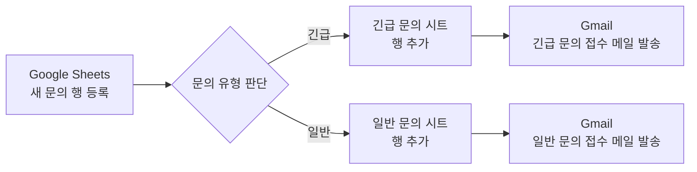
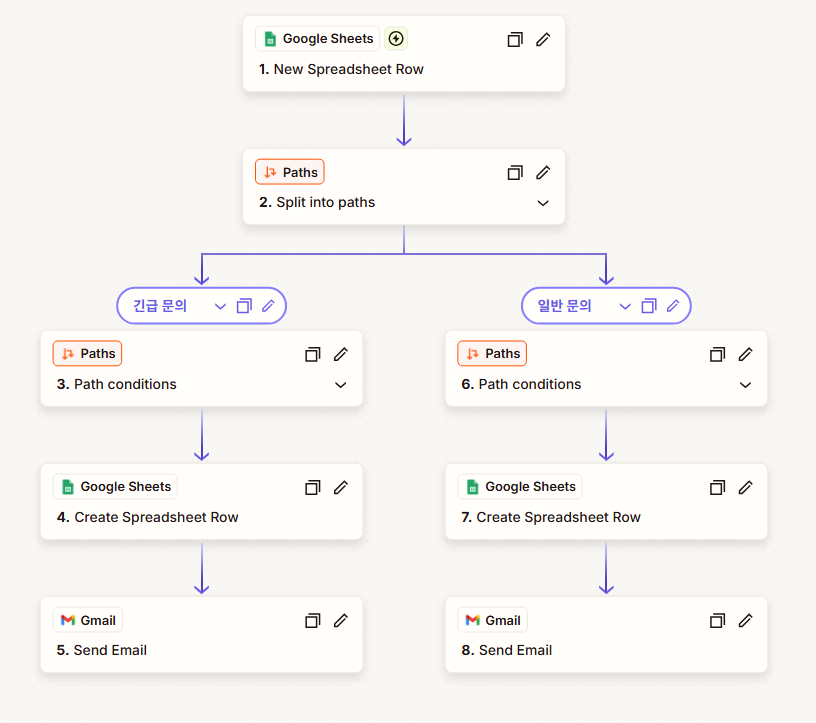

# 프로젝트 1 — Zapier vs n8n 자동화 도구 비교 구현

> 동일한 문의 접수 자동화 워크플로우를 Zapier와 n8n으로 각각 구현하고, Trigger·조건 분기·Action의 구조와 실제 실행 결과를 비교하였다.

## 1. 프로젝트 개요

### 1.1 구현 주제

고객 문의가 Google Sheets에 새 행으로 등록되면 문의 유형을 **긴급 문의**와 **일반 문의**로 구분하고, 각 유형에 맞는 시트에 데이터를 저장한 뒤 Gmail로 접수 확인 메일을 자동 발송하는 워크플로우를 구현하였다.

### 1.2 사용 도구

- Zapier
- n8n
- Google Sheets
- Gmail

### 1.3 공통 워크플로우



- **Trigger:** Google Sheets에 새로운 문의 행이 추가됨
- **조건 분기:** 문의 유형이 긴급인지 일반인지 판별
- **Action 1:** 문의 유형에 맞는 Google Sheets 탭에 행 추가
- **Action 2:** Gmail로 문의 접수 확인 메일 발송

## 2. Zapier 구현

Zapier에서는 Google Sheets의 **New Spreadsheet Row**를 Trigger로 사용하였다. 새 문의가 감지되면 **Paths** 기능을 통해 긴급 문의와 일반 문의의 두 경로로 분기하고, 각 경로에서 Google Sheets 기록과 Gmail 발송을 수행하도록 구성하였다.

1. **Trigger** — Google Sheets: New Spreadsheet Row
2. **조건 분기** — Paths: Split into paths
3. **긴급 문의 경로** — Path conditions → Create Spreadsheet Row → Send Email
4. **일반 문의 경로** — Path conditions → Create Spreadsheet Row → Send Email

긴급 문의 Path는 `문의 유형` 값이 `긴급`과 정확히 일치할 때만 진행되도록 설정했고, 일반 문의 Path는 같은 필드의 값이 `일반`과 정확히 일치할 때 진행되도록 설정하였다.

실행 결과 긴급 문의와 일반 문의가 각각 조건에 맞는 경로로 전달되었고, 해당 Google Sheets 탭에 정상 저장되었으며 Gmail 접수 확인 메일도 정상 발송되었다. Zapier의 History에서도 실행이 **Successful** 상태로 완료된 것을 확인하였다.

## 3. n8n 구현

n8n에서는 **Google Sheets Trigger — rowAdded**를 시작점으로 사용하였다. 새 행이 추가되면 **If 노드**가 `문의 유형`을 판별하고, true / false 출력에 따라 긴급 문의와 일반 문의 경로로 나누었다.

1. **Trigger** — Google Sheets Trigger: rowAdded
2. **조건 분기** — If
3. **True 경로** — 긴급 문의 → Append row in sheet → Send a message
4. **False 경로** — 일반 문의 → Append row in sheet → Send a message

조건식은 다음과 같이 구성하였다.

```text
{{$json['문의 유형']}}
is equal to
긴급
```

- **True:** 긴급 문의 처리
- **False:** 일반 문의 처리

Zapier가 긴급/일반 Path마다 조건을 별도로 지정하는 방식이라면, n8n은 하나의 If 조건 결과를 true / false로 나누는 방식이다. 두 도구 모두 동일한 업무 논리를 구현하지만 조건 분기를 표현하는 구조에는 차이가 있었다.

긴급 문의와 일반 문의를 각각 실제 입력하여 두 분기가 모두 실행되는 것을 확인했고, 각 문의가 해당 Google Sheets 탭에 저장된 뒤 유형에 맞는 Gmail 접수 확인 메일이 발송되는 것을 검증하였다.

## 4. 분기별 실행 결과

| 테스트 문의 | 문의 유형 | 분기 결과 | Google Sheets | Gmail |
|:---|:---:|:---|:---|:---|
| 긴급 문의 | 긴급 | 긴급 경로 실행 | 긴급 문의 탭 저장 | 긴급 문의 접수 메일 발송 |
| 일반 문의 | 일반 | 일반 경로 실행 | 일반 문의 탭 저장 | 일반 문의 접수 메일 발송 |

두 자동화 도구 모두 같은 입력 구조와 같은 최종 결과를 만들도록 구성했으며, 긴급과 일반 두 경로를 각각 1회 이상 실제 실행하여 조건 분기가 정상 동작함을 확인하였다.

## 5. Zapier와 n8n 비교 분석

| 비교 항목 | Zapier | n8n |
|:---|:---|:---|
| UI / UX | 단계별 카드와 Paths 중심으로 흐름을 구성하여 작업 순서를 따라가기 쉽다. | 노드를 직접 연결하는 캔버스 방식으로 전체 데이터 흐름을 한눈에 확인하기 쉽다. |
| 설정 난이도 | Trigger와 Action을 순서대로 설정하는 방식이라 기본 자동화 구성은 비교적 직관적이었다. | 노드별 설정 방식이 명확했으며 이번 수준의 워크플로우에서는 Zapier와 큰 난이도 차이를 느끼지 않았다. |
| 조건 분기 방식 | Paths에서 긴급 문의와 일반 문의 경로를 각각 명시적으로 구성한다. | If 노드의 true / false 출력으로 조건 결과를 바로 나눈다. |
| 워크플로우 시각화 | 위에서 아래로 단계가 배치되어 실행 순서를 읽기 쉽다. | 분기와 후속 작업의 관계를 한 화면에서 파악하기 쉽다. |
| 실행 로그 확인 | History에서 Successful 여부와 실행 단위를 확인할 수 있다. | 실행된 노드와 분기로 전달된 item 수를 캔버스 및 Executions에서 확인할 수 있다. |
| 확장성 체감 | 정형화된 SaaS 자동화를 빠르게 구성하기에 편리하다. | 노드를 추가하고 연결하는 방식이라 복잡한 분기나 데이터 처리로 확장하기 좋다고 느꼈다. |
| 직접 사용한 체감 | 이번 수준의 자동화에서는 특별한 불편함 없이 구현할 수 있었다. | Zapier와 전반적인 난이도는 비슷했으며 노드 방식에 익숙해지면 전체 흐름을 파악하기 편했다. |

### 5.1 Zapier 장단점

#### 장점

- Trigger → Paths → Action 순서가 명확해 처음 흐름을 따라가기 쉽다.
- 각 분기 경로가 별도로 표시되어 긴급 문의와 일반 문의의 처리 내용을 구분하기 쉽다.
- History에서 실행 성공 여부를 확인하기 편리하다.

#### 단점

- 분기가 많아질수록 전체 흐름을 한 화면에서 파악하는 데 제약이 있을 수 있다.
- 세부적인 데이터 흐름을 시각적으로 추적하는 부분은 n8n보다 덜 직접적으로 느껴졌다.

### 5.2 n8n 장단점

#### 장점

- 노드를 연결하는 방식이라 Trigger, 조건 분기, Action 간 관계가 한눈에 보인다.
- If의 true / false 출력과 각 경로의 item 수를 통해 실행 결과를 시각적으로 확인하기 쉽다.
- 워크플로우 확장 시 노드를 추가하고 연결하는 구조가 명확하다.

#### 단점

- 노드가 많아질 경우 캔버스 정리가 필요하다.
- 처음에는 각 노드의 입력·출력 관계를 이해해야 한다.

### 5.3 어떤 상황에서 적합한가

- **Zapier:** 비교적 단순하고 정형화된 SaaS 자동화를 빠르게 만들고 싶을 때 적합하다고 판단하였다.
- **n8n:** 분기 구조와 데이터 흐름을 한 화면에서 확인하거나 향후 더 복잡한 자동화로 확장할 때 적합하다고 판단하였다.

이번 프로젝트에서는 두 도구의 기본적인 설정 난이도와 실제 사용 편의성이 대동소이했다. 따라서 어느 한 도구가 절대적으로 더 쉽다고 보기보다 자동화의 규모와 향후 확장 방향에 따라 선택하는 것이 적절하다고 보았다.

## 6. 평가 시 재현 및 재실행 방법

이 절차는 제출 후 평가자가 자동화를 다시 확인하거나, 동일한 환경에서 긴급/일반 두 분기가 실제로 작동하는지 재검증하기 위한 방법이다.

### 6.1 공통 준비

1. 원본 문의 Google Sheets와 `긴급 문의`, `일반 문의` 결과 탭이 존재하는지 확인한다.
2. 테스트 입력에는 `이름`, `이메일`, `문의 유형`, `문의 내용`이 포함되도록 한다.
3. 문의 유형은 정확히 `긴급` 또는 `일반`로 입력한다.
4. 연결된 Google Form이 있다면 Form 제출로 새 행을 만들 수 있고, 평가 시에는 원본 문의 시트에 새 행을 직접 추가해도 Trigger를 검증할 수 있다.
5. 중복 저장과 중복 메일을 피하려면 **Zapier와 n8n을 동시에 테스트하지 않고 한 도구씩 실행**하는 것을 권장한다.

### 6.2 Zapier 재실행

1. Zapier에서 프로젝트 1 Zap을 연다.
2. Zap이 **Published / On** 상태인지 확인한다.
3. 원본 문의 시트에 문의 유형이 `긴급`인 새 테스트 행을 추가한다.
4. Zapier History에서 해당 실행이 Successful인지 확인한다.
5. `긴급 문의` 시트에 데이터가 추가되고 긴급 문의 접수 메일이 도착했는지 확인한다.
6. 문의 유형이 `일반`인 새 테스트 행을 추가한다.
7. History, `일반 문의` 시트, 일반 문의 접수 메일을 같은 방식으로 확인한다.

### 6.3 n8n 재실행

1. n8n에서 프로젝트 1 워크플로우를 연다.
2. 워크플로우가 **Active** 상태인지 확인한다.
3. 원본 문의 시트에 문의 유형이 `긴급`인 새 테스트 행을 추가한다.
4. Executions 또는 워크플로 실행 기록에서 If 노드의 true 경로가 실행됐는지 확인한다.
5. `긴급 문의` 시트와 Gmail 수신 결과를 확인한다.
6. 문의 유형이 `일반`인 새 테스트 행을 추가한다.
7. If 노드의 false 경로, `일반 문의` 시트, Gmail 수신 결과를 확인한다.

### 6.4 재검증 체크리스트

- [ ] Zapier 긴급 경로 실행
- [ ] Zapier 일반 경로 실행
- [ ] n8n true 경로 실행
- [ ] n8n false 경로 실행
- [ ] 각 결과 시트에 새 행 추가 확인
- [ ] 긴급·일반 Gmail 자동 발송 확인

> [!TIP]
> 테스트할 때는 이전 행과 구분할 수 있도록 이름이나 문의 내용에 `평가테스트-긴급`, `평가테스트-일반`처럼 식별 문구를 넣으면 실행 결과를 확인하기 쉽다.

## 7. 제출용 핵심 스크린샷

보고서에는 설정 과정을 모두 나열하지 않고, 과제 요구사항을 직접 확인할 수 있는 핵심 이미지 5장만 사용한다. 나머지 테스트·설정 화면은 개인 원본으로만 보관하고 GitHub에는 업로드하지 않는다.

### 7.1 본문에 넣을 핵심 이미지

1. **P1-01 Zapier 전체 워크플로우** — Google Sheets Trigger → Paths → 긴급/일반 → Google Sheets → Gmail 전체 구조
2. **P1-02 Zapier 실행 History** — 긴급·일반 테스트에 해당하는 두 실행이 Successful로 완료된 기록
3. **P1-03 n8n 전체 워크플로우 및 분기 결과** — Google Sheets Trigger → If → true/false → Sheets → Gmail 구조와 분기별 item 수
4. **P1-04 긴급 문의 Gmail 결과** — 긴급 문의 경로 실행 후 실제 도착한 접수 확인 메일
5. **P1-05 일반 문의 Gmail 결과** — 일반 문의 경로 실행 후 실제 도착한 접수 확인 메일

이 다섯 장으로 두 도구의 워크플로우 구성, Zapier 실행 성공 기록, n8n 조건 분기 결과, 긴급·일반 두 경로의 최종 Action 결과를 확인할 수 있다.

### 7.2 권장 GitHub 폴더 구조

```text
images/
├── project1/
│   ├── P1-01-zapier-workflow.png
│   ├── P1-02-zapier-history.png
│   ├── P1-03-n8n-workflow.png
│   ├── P1-04-urgent-email.png
│   └── P1-05-normal-email.png
└── project2/
    ├── P2-01-webhook-trigger.png
    ├── P2-02-if-condition.png
    ├── P2-03-n8n-final-workflow.png
    ├── P2-04-sheets-result.png
    └── P2-05-email-result.png
```

### 7.3 이미지 삽입 예시

스크린샷을 업로드한 뒤 필요한 위치에 다음 형식으로 삽입한다.

```markdown

```

## 8. 과제 요구사항 대응

- [x] 서로 다른 2개 자동화 도구 사용 — Zapier, n8n
- [x] 동일한 워크플로우 구조 구현
- [x] Trigger 1개 이상 포함
- [x] Action 2개 이상 포함
- [x] 조건 분기 1개 이상 포함
- [x] 긴급 문의 경로 실제 실행
- [x] 일반 문의 경로 실제 실행
- [x] Google Sheets 저장 결과 확인
- [x] Gmail 자동 발송 결과 확인
- [x] 비교 항목 5개 이상 작성
- [x] 각 도구 장단점 작성
- [x] 상황별 적합성 의견 작성
- [x] 평가 시 재현 가능한 실행 절차 작성

## 9. 보안 및 제출 기준

- 계정 이메일 주소는 필요한 경우 일부 마스킹한다.
- API Key, 토큰, 비밀번호 등 민감정보는 캡처와 문서에 노출하지 않는다.
- 평가에 필요한 노드 이름, 분기 조건, 실행 상태는 보이도록 남긴다.
- 세부 캡처는 삭제하지 않고 `evidence` 폴더에 원본으로 보관한다.

## 10. 학습 내용 및 결론

이번 구현을 통해 Trigger는 자동화를 시작시키는 이벤트이고, 조건 분기는 입력 데이터를 기준으로 이후 처리 경로를 결정하며, Action은 결정된 경로에서 실제 업무를 수행하는 단계라는 점을 확인하였다.

동일한 업무를 Zapier와 n8n으로 각각 구현하면서 **도구의 화면 구성이나 분기 표현 방식은 달라도 자동화의 기본 논리 구조는 동일하다**는 점을 이해할 수 있었다. Zapier는 단계별 설정과 Paths 구조가 명확했고, n8n은 노드 기반 화면에서 전체 흐름과 분기 결과를 직접 확인하기 좋았다.

> [!IMPORTANT]
> **결론:** Zapier와 n8n 모두 이번 문의 분류 자동화를 정상 구현할 수 있었다. 두 도구의 사용 난이도는 전반적으로 비슷하게 느껴졌으며, 프로젝트 2에서는 n8n을 활용해 Webhook 기반 자동화로 범위를 확장하였다.
