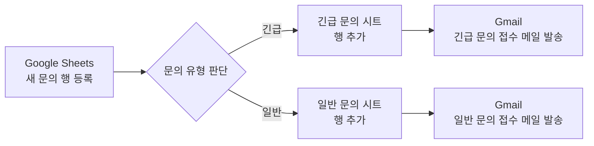
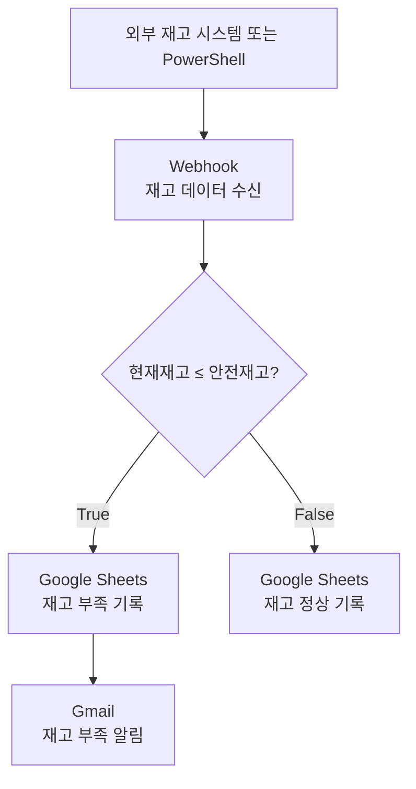
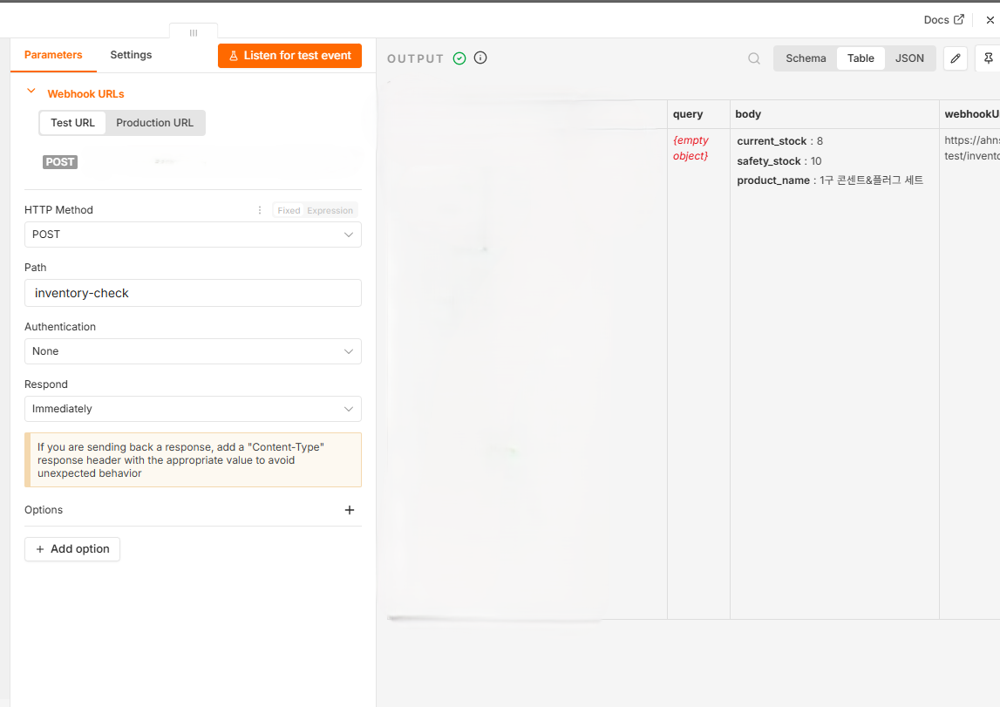
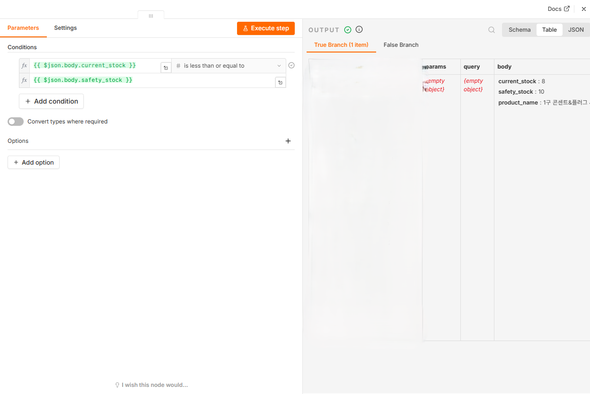
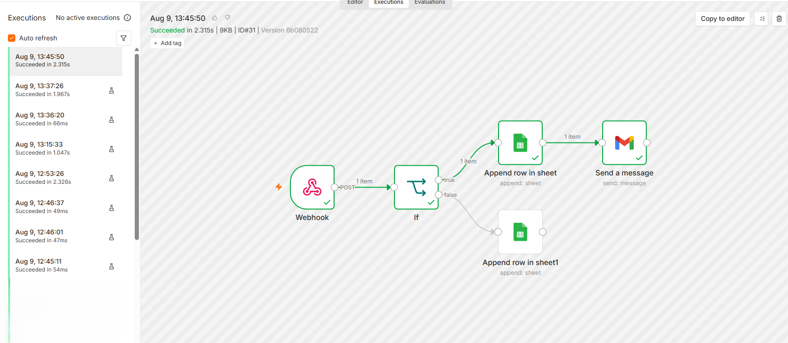
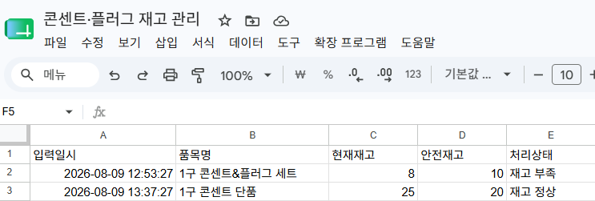
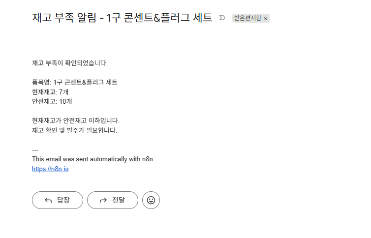
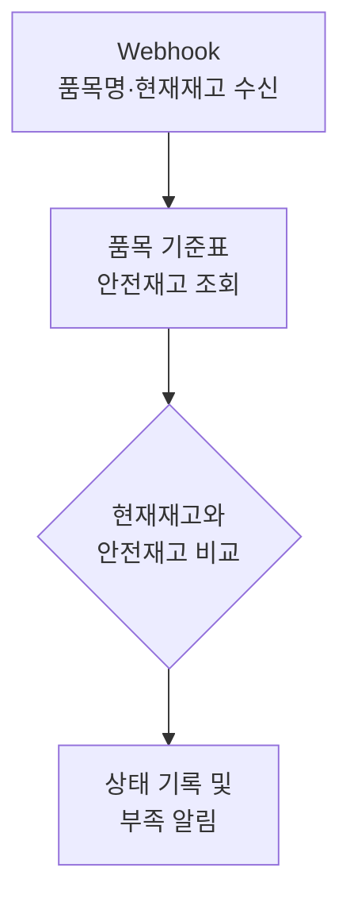

# 프로젝트 1 — Zapier vs n8n 자동화 도구 비교 구현

> 동일한 문의 접수 자동화 워크플로우를 Zapier와 n8n으로 각각 구현하고, Trigger·조건 분기·Action의 구조와 실제 실행 결과를 비교하였다.

## 1. 프로젝트 개요

### 1.1 구현 주제

고객 문의가 Google Sheets에 새 행으로 등록되면 문의 유형을 **긴급 문의**와 **일반 문의**로 구분하고, 각 유형에 맞는 시트에 데이터를 저장한 뒤 Gmail로 접수 확인 메일을 자동 발송하는 워크플로우를 구현하였다.

### 1.2 사용 도구

- Zapier
- n8n
- Google Sheets
- Gmail

### 1.3 공통 워크플로우



- **Trigger:** Google Sheets에 새로운 문의 행이 추가됨
- **조건 분기:** 문의 유형이 긴급인지 일반인지 판별
- **Action 1:** 문의 유형에 맞는 Google Sheets 탭에 행 추가
- **Action 2:** Gmail로 문의 접수 확인 메일 발송

## 2. Zapier 구현

Zapier에서는 Google Sheets의 **New Spreadsheet Row**를 Trigger로 사용하였다. 새 문의가 감지되면 **Paths** 기능을 통해 긴급 문의와 일반 문의의 두 경로로 분기하고, 각 경로에서 Google Sheets 기록과 Gmail 발송을 수행하도록 구성하였다.

1. **Trigger** — Google Sheets: New Spreadsheet Row
2. **조건 분기** — Paths: Split into paths
3. **긴급 문의 경로** — Path conditions → Create Spreadsheet Row → Send Email
4. **일반 문의 경로** — Path conditions → Create Spreadsheet Row → Send Email

긴급 문의 Path는 `문의 유형` 값이 `긴급`과 정확히 일치할 때만 진행되도록 설정했고, 일반 문의 Path는 같은 필드의 값이 `일반`과 정확히 일치할 때 진행되도록 설정하였다.

실행 결과 긴급 문의와 일반 문의가 각각 조건에 맞는 경로로 전달되었고, 해당 Google Sheets 탭에 정상 저장되었으며 Gmail 접수 확인 메일도 정상 발송되었다. Zapier의 History에서도 실행이 **Successful** 상태로 완료된 것을 확인하였다.

## 3. n8n 구현

n8n에서는 **Google Sheets Trigger — rowAdded**를 시작점으로 사용하였다. 새 행이 추가되면 **If 노드**가 `문의 유형`을 판별하고, true / false 출력에 따라 긴급 문의와 일반 문의 경로로 나누었다.

1. **Trigger** — Google Sheets Trigger: rowAdded
2. **조건 분기** — If
3. **True 경로** — 긴급 문의 → Append row in sheet → Send a message
4. **False 경로** — 일반 문의 → Append row in sheet → Send a message

조건식은 다음과 같이 구성하였다.

```text
{{$json['문의 유형']}}
is equal to
긴급
```

- **True:** 긴급 문의 처리
- **False:** 일반 문의 처리

Zapier가 긴급/일반 Path마다 조건을 별도로 지정하는 방식이라면, n8n은 하나의 If 조건 결과를 true / false로 나누는 방식이다. 두 도구 모두 동일한 업무 논리를 구현하지만 조건 분기를 표현하는 구조에는 차이가 있었다.

긴급 문의와 일반 문의를 각각 실제 입력하여 두 분기가 모두 실행되는 것을 확인했고, 각 문의가 해당 Google Sheets 탭에 저장된 뒤 유형에 맞는 Gmail 접수 확인 메일이 발송되는 것을 검증하였다.

## 4. 분기별 실행 결과

| 테스트 문의 | 문의 유형 | 분기 결과 | Google Sheets | Gmail |
|:---|:---:|:---|:---|:---|
| 긴급 문의 | 긴급 | 긴급 경로 실행 | 긴급 문의 탭 저장 | 긴급 문의 접수 메일 발송 |
| 일반 문의 | 일반 | 일반 경로 실행 | 일반 문의 탭 저장 | 일반 문의 접수 메일 발송 |

두 자동화 도구 모두 같은 입력 구조와 같은 최종 결과를 만들도록 구성했으며, 긴급과 일반 두 경로를 각각 1회 이상 실제 실행하여 조건 분기가 정상 동작함을 확인하였다.

## 5. Zapier와 n8n 비교 분석

| 비교 항목 | Zapier | n8n |
|:---|:---|:---|
| UI / UX | 단계별 카드와 Paths 중심으로 흐름을 구성하여 작업 순서를 따라가기 쉽다. | 노드를 직접 연결하는 캔버스 방식으로 전체 데이터 흐름을 한눈에 확인하기 쉽다. |
| 설정 난이도 | Trigger와 Action을 순서대로 설정하는 방식이라 기본 자동화 구성은 비교적 직관적이었다. | 노드별 설정 방식이 명확했으며 이번 수준의 워크플로우에서는 Zapier와 큰 난이도 차이를 느끼지 않았다. |
| 조건 분기 방식 | Paths에서 긴급 문의와 일반 문의 경로를 각각 명시적으로 구성한다. | If 노드의 true / false 출력으로 조건 결과를 바로 나눈다. |
| 워크플로우 시각화 | 위에서 아래로 단계가 배치되어 실행 순서를 읽기 쉽다. | 분기와 후속 작업의 관계를 한 화면에서 파악하기 쉽다. |
| 실행 로그 확인 | History에서 Successful 여부와 실행 단위를 확인할 수 있다. | 실행된 노드와 분기로 전달된 item 수를 캔버스 및 Executions에서 확인할 수 있다. |
| 확장성 체감 | 정형화된 SaaS 자동화를 빠르게 구성하기에 편리하다. | 노드를 추가하고 연결하는 방식이라 복잡한 분기나 데이터 처리로 확장하기 좋다고 느꼈다. |
| 직접 사용한 체감 | 이번 수준의 자동화에서는 특별한 불편함 없이 구현할 수 있었다. | Zapier와 전반적인 난이도는 비슷했으며 노드 방식에 익숙해지면 전체 흐름을 파악하기 편했다. |

### 5.1 Zapier 장단점

#### 장점

- Trigger → Paths → Action 순서가 명확해 처음 흐름을 따라가기 쉽다.
- 각 분기 경로가 별도로 표시되어 긴급 문의와 일반 문의의 처리 내용을 구분하기 쉽다.
- History에서 실행 성공 여부를 확인하기 편리하다.

#### 단점

- 분기가 많아질수록 전체 흐름을 한 화면에서 파악하는 데 제약이 있을 수 있다.
- 세부적인 데이터 흐름을 시각적으로 추적하는 부분은 n8n보다 덜 직접적으로 느껴졌다.

### 5.2 n8n 장단점

#### 장점

- 노드를 연결하는 방식이라 Trigger, 조건 분기, Action 간 관계가 한눈에 보인다.
- If의 true / false 출력과 각 경로의 item 수를 통해 실행 결과를 시각적으로 확인하기 쉽다.
- 워크플로우 확장 시 노드를 추가하고 연결하는 구조가 명확하다.

#### 단점

- 노드가 많아질 경우 캔버스 정리가 필요하다.
- 처음에는 각 노드의 입력·출력 관계를 이해해야 한다.

### 5.3 어떤 상황에서 적합한가

- **Zapier:** 비교적 단순하고 정형화된 SaaS 자동화를 빠르게 만들고 싶을 때 적합하다고 판단하였다.
- **n8n:** 분기 구조와 데이터 흐름을 한 화면에서 확인하거나 향후 더 복잡한 자동화로 확장할 때 적합하다고 판단하였다.

이번 프로젝트에서는 두 도구의 기본적인 설정 난이도와 실제 사용 편의성이 대동소이했다. 따라서 어느 한 도구가 절대적으로 더 쉽다고 보기보다 자동화의 규모와 향후 확장 방향에 따라 선택하는 것이 적절하다고 보았다.

## 6. 평가 시 재현 및 재실행 방법

이 절차는 제출 후 평가자가 자동화를 다시 확인하거나, 동일한 환경에서 긴급/일반 두 분기가 실제로 작동하는지 재검증하기 위한 방법이다.

### 6.1 공통 준비

1. 원본 문의 Google Sheets와 `긴급 문의`, `일반 문의` 결과 탭이 존재하는지 확인한다.
2. 테스트 입력에는 `이름`, `이메일`, `문의 유형`, `문의 내용`이 포함되도록 한다.
3. 문의 유형은 정확히 `긴급` 또는 `일반`로 입력한다.
4. 연결된 Google Form이 있다면 Form 제출로 새 행을 만들 수 있고, 평가 시에는 원본 문의 시트에 새 행을 직접 추가해도 Trigger를 검증할 수 있다.
5. 중복 저장과 중복 메일을 피하려면 **Zapier와 n8n을 동시에 테스트하지 않고 한 도구씩 실행**하는 것을 권장한다.

### 6.2 Zapier 재실행

1. Zapier에서 프로젝트 1 Zap을 연다.
2. Zap이 **Published / On** 상태인지 확인한다.
3. 원본 문의 시트에 문의 유형이 `긴급`인 새 테스트 행을 추가한다.
4. Zapier History에서 해당 실행이 Successful인지 확인한다.
5. `긴급 문의` 시트에 데이터가 추가되고 긴급 문의 접수 메일이 도착했는지 확인한다.
6. 문의 유형이 `일반`인 새 테스트 행을 추가한다.
7. History, `일반 문의` 시트, 일반 문의 접수 메일을 같은 방식으로 확인한다.

### 6.3 n8n 재실행

1. n8n에서 프로젝트 1 워크플로우를 연다.
2. 워크플로우가 **Active** 상태인지 확인한다.
3. 원본 문의 시트에 문의 유형이 `긴급`인 새 테스트 행을 추가한다.
4. Executions 또는 워크플로 실행 기록에서 If 노드의 true 경로가 실행됐는지 확인한다.
5. `긴급 문의` 시트와 Gmail 수신 결과를 확인한다.
6. 문의 유형이 `일반`인 새 테스트 행을 추가한다.
7. If 노드의 false 경로, `일반 문의` 시트, Gmail 수신 결과를 확인한다.

### 6.4 재검증 체크리스트

- [ ] Zapier 긴급 경로 실행
- [ ] Zapier 일반 경로 실행
- [ ] n8n true 경로 실행
- [ ] n8n false 경로 실행
- [ ] 각 결과 시트에 새 행 추가 확인
- [ ] 긴급·일반 Gmail 자동 발송 확인

> [!TIP]
> 테스트할 때는 이전 행과 구분할 수 있도록 이름이나 문의 내용에 `평가테스트-긴급`, `평가테스트-일반`처럼 식별 문구를 넣으면 실행 결과를 확인하기 쉽다.

## 7. 제출용 핵심 스크린샷

보고서에는 설정 과정을 모두 나열하지 않고, 과제 요구사항을 직접 확인할 수 있는 핵심 이미지 5장만 사용한다. 나머지 테스트·설정 화면은 개인 원본으로만 보관하고 GitHub에는 업로드하지 않는다.

### 7.1 본문에 넣을 핵심 이미지

1. **P1-01 Zapier 전체 워크플로우** — Google Sheets Trigger → Paths → 긴급/일반 → Google Sheets → Gmail 전체 구조
2. **P1-02 Zapier 실행 History** — 긴급·일반 테스트에 해당하는 두 실행이 Successful로 완료된 기록
3. **P1-03 n8n 전체 워크플로우 및 분기 결과** — Google Sheets Trigger → If → true/false → Sheets → Gmail 구조와 분기별 item 수
4. **P1-04 긴급 문의 Gmail 결과** — 긴급 문의 경로 실행 후 실제 도착한 접수 확인 메일
5. **P1-05 일반 문의 Gmail 결과** — 일반 문의 경로 실행 후 실제 도착한 접수 확인 메일

이 다섯 장으로 두 도구의 워크플로우 구성, Zapier 실행 성공 기록, n8n 조건 분기 결과, 긴급·일반 두 경로의 최종 Action 결과를 확인할 수 있다.

### 7.2 권장 GitHub 폴더 구조

```text
images/
├── project1/
│   ├── P1-01-zapier-workflow.png
│   ├── P1-02-zapier-history.png
│   ├── P1-03-n8n-workflow.png
│   ├── P1-04-urgent-email.png
│   └── P1-05-normal-email.png
└── project2/
    ├── P2-01-webhook-trigger.png
    ├── P2-02-if-condition.png
    ├── P2-03-n8n-final-workflow.png
    ├── P2-04-sheets-result.png
    └── P2-05-email-result.png
```

### 7.3 이미지 삽입 예시

스크린샷을 업로드한 뒤 필요한 위치에 다음 형식으로 삽입한다.

```markdown

```

## 8. 과제 요구사항 대응

- [x] 서로 다른 2개 자동화 도구 사용 — Zapier, n8n
- [x] 동일한 워크플로우 구조 구현
- [x] Trigger 1개 이상 포함
- [x] Action 2개 이상 포함
- [x] 조건 분기 1개 이상 포함
- [x] 긴급 문의 경로 실제 실행
- [x] 일반 문의 경로 실제 실행
- [x] Google Sheets 저장 결과 확인
- [x] Gmail 자동 발송 결과 확인
- [x] 비교 항목 5개 이상 작성
- [x] 각 도구 장단점 작성
- [x] 상황별 적합성 의견 작성
- [x] 평가 시 재현 가능한 실행 절차 작성

## 9. 보안 및 제출 기준

- 계정 이메일 주소는 필요한 경우 일부 마스킹한다.
- API Key, 토큰, 비밀번호 등 민감정보는 캡처와 문서에 노출하지 않는다.
- 평가에 필요한 노드 이름, 분기 조건, 실행 상태는 보이도록 남긴다.
- 세부 캡처는 삭제하지 않고 `evidence` 폴더에 원본으로 보관한다.

## 10. 학습 내용 및 결론

이번 구현을 통해 Trigger는 자동화를 시작시키는 이벤트이고, 조건 분기는 입력 데이터를 기준으로 이후 처리 경로를 결정하며, Action은 결정된 경로에서 실제 업무를 수행하는 단계라는 점을 확인하였다.

동일한 업무를 Zapier와 n8n으로 각각 구현하면서 **도구의 화면 구성이나 분기 표현 방식은 달라도 자동화의 기본 논리 구조는 동일하다**는 점을 이해할 수 있었다. Zapier는 단계별 설정과 Paths 구조가 명확했고, n8n은 노드 기반 화면에서 전체 흐름과 분기 결과를 직접 확인하기 좋았다.

> [!IMPORTANT]
> **결론:** Zapier와 n8n 모두 이번 문의 분류 자동화를 정상 구현할 수 있었다. 두 도구의 사용 난이도는 전반적으로 비슷하게 느껴졌으며, 프로젝트 2에서는 n8n을 활용해 Webhook 기반 자동화로 범위를 확장하였다.
>---
> # 프로젝트 2 — n8n Webhook 기반 재고 부족 자동 감지 및 알림

> n8n의 Webhook으로 품목별 재고 데이터를 수신하고, 현재재고가 안전재고 이하인지 자동 판정하여 Google Sheets에 기록한다. 재고가 부족한 경우에만 Gmail 알림을 발송하도록 구현하였다.

> [!NOTE]
> **최종 구현 상태**
> - Webhook Test URL 및 Production URL 수신 성공
> - 재고 부족(True)·재고 정상(False) 분기 성공
> - 두 결과 모두 Google Sheets 자동 기록 성공
> - 재고 부족 시 Gmail 알림 발송 성공

> [!TIP]
> **과제 필수 요건 충족 요약**
> - Trigger 1개: Webhook
> - Action 2개 이상: Google Sheets 기록, Gmail 발송
> - 조건 분기 1개: IF 노드
> - 각 분기 실행: True와 False를 각각 1회 이상 실제 실행
> - 자동 실행: Publish 후 Production URL 요청만으로 전체 워크플로우 자동 실행

## 1. 프로젝트 주제 및 기획 의도

### 1.1 프로젝트명

**콘센트·플러그 재고 부족 자동 감지 및 알림 시스템**

### 1.2 기획 배경

전기 콘센트·플러그 판매 사업에서는 품목별 현재재고와 안전재고가 서로 다르다. 재고를 수동으로 확인하면 확인 누락이나 발주 지연이 생길 수 있으므로, 재고 데이터가 들어오는 즉시 부족 여부를 자동 판정하는 워크플로우를 설계하였다.

### 1.3 목표

- 외부에서 전달된 재고 데이터를 Webhook으로 수신한다.
- 각 품목의 **현재재고 ≤ 안전재고** 여부를 자동 판단한다.
- 재고 상태를 Google Sheets에 누적 기록한다.
- 재고가 부족할 때만 Gmail로 담당자에게 알린다.
- Publish 후 Production URL에서도 자동 실행되는지 확인한다.

## 2. 도구 선정 및 역할

| 도구 | 역할 | 선정 이유 |
|:--|:--|:--|
| n8n | 전체 워크플로우 구성 및 조건 분기 | Webhook Trigger, IF 분기, Google Sheets·Gmail 연동을 한 화면에서 구성하고 실행 데이터를 확인하기 쉽다. |
| Webhook | 외부 재고 데이터 수신 | 외부 이벤트가 발생하는 즉시 자동화를 시작할 수 있다. |
| Google Sheets | 재고 상태 이력 저장 | 결과 확인과 공유가 쉽고 별도 데이터베이스 없이 기록할 수 있다. |
| Gmail | 재고 부족 알림 발송 | 부족 상황만 즉시 확인할 수 있다. |
| PowerShell | Webhook 테스트 데이터 전송 | Windows 환경에서 별도 프로그램 없이 POST 요청을 재현할 수 있다. |

n8n을 선택한 가장 큰 이유는 **Webhook을 Trigger로 직접 사용할 수 있고, IF의 True·False 분기와 각 노드의 실행 결과를 시각적으로 확인하기 쉽기 때문**이다. 이번 구현 범위에서는 별도 유료 Action이나 생성형 AI API도 필요하지 않았다.

## 3. Webhook 개념과 전체 워크플로우

Webhook은 Google Form 자체가 아니라 **외부 시스템이 데이터를 보내는 인터넷상의 수신 주소**이다. n8n의 Webhook URL로 데이터가 도착하면 이를 Trigger로 워크플로우가 시작된다.

- **Trigger:** 자동화를 시작시키는 사건. 이 프로젝트에서는 Webhook에 재고 JSON 데이터가 도착하는 사건이다.
- **Action:** Trigger 이후 수행되는 실제 작업. Google Sheets 행 추가와 Gmail 메시지 발송이 해당한다.
- **조건 분기:** 입력값에 따라 실행 경로를 나누는 기능. IF 노드가 `현재재고 ≤ 안전재고`를 판단한다.



> [!TIP]
> 품목마다 안전재고가 달라도 IF 노드를 추가할 필요는 없다. Webhook 요청마다 `product_name`, `current_stock`, `safety_stock`을 함께 보내면 하나의 IF 노드가 각 입력값을 기준으로 판단한다.

## 4. 사전 준비

### 4.1 Google Sheets

- 스프레드시트 이름: **콘센트·플러그 재고 관리**
- 시트 탭 이름: **재고 기록**

| 열 | 항목 |
|:--:|:--|
| A열 | 입력일시 |
| B열 | 품목명 |
| C열 | 현재재고 |
| D열 | 안전재고 |
| E열 | 처리상태 |

### 4.2 Webhook 데이터 형식

```json
{
  "product_name": "1구 콘센트&플러그 세트",
  "current_stock": 8,
  "safety_stock": 10
}
```

- 재고 수량은 숫자형으로 보낸다.
- 한글 깨짐을 방지하기 위해 PowerShell 요청에서는 UTF-8 바이트로 전송한다.

## 5. n8n 구현 구조

### 5.1 Webhook 노드

- HTTP Method: `POST`
- Path: `inventory-check`
- 구축 중: Test URL 사용
- 게시 후: Production URL 사용



### 5.2 IF 조건 분기

비교 자료형은 **Number**로 설정하였다.

```text
{{ $json.body.current_stock }}
is less than or equal to
{{ $json.body.safety_stock }}
```

- **True:** 현재재고가 안전재고 이하 → 재고 부족
- **False:** 현재재고가 안전재고보다 많음 → 재고 정상



### 5.3 True 경로 — 재고 부족

Google Sheets의 **Append row in sheet** 노드로 다음 값을 기록한다.

- 입력일시: `{{ $now.setZone('Asia/Seoul').toFormat('yyyy-MM-dd HH:mm:ss') }}`
- 품목명: `{{ $json.body.product_name }}`
- 현재재고: `{{ $json.body.current_stock }}`
- 안전재고: `{{ $json.body.safety_stock }}`
- 처리상태: `재고 부족`

이후 Gmail의 **Send a message** 노드를 연결한다.

제목:

```text
재고 부족 알림 - {{ $json.body.product_name }}
```

본문:

```text
재고 부족이 확인되었습니다.
품목명: {{ $json.body.product_name }}
현재재고: {{ $json.body.current_stock }}개
안전재고: {{ $json.body.safety_stock }}개
현재재고가 안전재고 이하입니다. 재고 확인 및 발주가 필요합니다.
```

### 5.4 False 경로 — 재고 정상

False 출력에도 Google Sheets의 **Append row in sheet** 노드를 연결하였다. 값 매핑은 True 경로와 같고 처리상태만 `재고 정상`으로 저장한다.

정상 재고에는 Gmail을 연결하지 않았다. 정상 상태까지 매번 메일을 보내면 불필요한 알림이 많아져 중요한 부족 알림을 놓칠 수 있기 때문이다.

### 5.5 최종 워크플로우



## 6. 실행 및 재현 방법

이 프로젝트는 **Test URL을 이용한 개발 테스트**와 **Production URL을 이용한 실제 자동 실행 테스트**를 모두 재현할 수 있다.

### 6.1 Test URL — 재고 부족 테스트

1. n8n에서 Webhook 노드를 연다.
2. **Test URL**을 복사한다.
3. **Listen for test event**를 누른다.
4. PowerShell을 열고 아래 명령의 URL만 자신의 Test URL로 교체한다.
5. 명령을 실행한 뒤 n8n, Google Sheets, Gmail 결과를 확인한다.

```powershell
$body = @{
  product_name = "1구 콘센트&플러그 세트"
  current_stock = 8
  safety_stock = 10
} | ConvertTo-Json

Invoke-RestMethod -Method Post `
  -Uri "여기에_Test_URL_붙여넣기" `
  -ContentType "application/json; charset=utf-8" `
  -Body ([System.Text.Encoding]::UTF8.GetBytes($body))
```

예상 결과: **8 ≤ 10 → True**

Google Sheets에 `재고 부족`으로 기록되고 Gmail 알림이 발송된다.

### 6.2 Test URL — 재고 정상 테스트

Webhook에서 다시 **Listen for test event**를 누른 뒤 실행한다.

```powershell
$body = @{
  product_name = "1구 콘센트 단품"
  current_stock = 25
  safety_stock = 20
} | ConvertTo-Json

Invoke-RestMethod -Method Post `
  -Uri "여기에_Test_URL_붙여넣기" `
  -ContentType "application/json; charset=utf-8" `
  -Body ([System.Text.Encoding]::UTF8.GetBytes($body))
```

예상 결과: **25 ≤ 20 → False**

Google Sheets에 `재고 정상`으로 기록되고 Gmail은 발송되지 않는다.

### 6.3 Production URL — 게시 후 자동 실행 테스트

1. 워크플로우 오른쪽 위 **Publish**를 누른다.
2. Webhook 노드에서 **Production URL**을 선택한다.
3. `/webhook/inventory-check`로 끝나는 URL을 복사한다.
4. Production URL에서는 **Listen for test event를 누르지 않는다.**
5. 아래 PowerShell 명령의 URL을 Production URL로 교체해 실행한다.

```powershell
$body = @{
  product_name = "1구 콘센트&플러그 세트"
  current_stock = 7
  safety_stock = 10
} | ConvertTo-Json

Invoke-RestMethod -Method Post `
  -Uri "여기에_Production_URL_붙여넣기" `
  -ContentType "application/json; charset=utf-8" `
  -Body ([System.Text.Encoding]::UTF8.GetBytes($body))
```

예상 결과: **7 ≤ 10 → True**

Google Sheets 기록과 Gmail 발송이 자동으로 완료된다. 편집 화면에 실행선이 바로 나타나지 않으면 **Executions**에서 운영 실행 기록을 확인한다.

> [!IMPORTANT]
> **평가 시 가장 중요한 재현 방법:** 워크플로우가 Publish 상태인지 확인한 뒤 Production URL에 POST 요청을 보내면 별도 대기 버튼 없이 Webhook → IF → Google Sheets → 필요 시 Gmail까지 자동 실행된다.

## 7. 테스트 결과

| 구분 | 현재재고 | 안전재고 | IF 결과 | 시트 기록 | 메일 |
|:--|--:|--:|:--:|:--:|:--:|
| 부족 테스트 | 8 | 10 | True | 재고 부족 | 발송 |
| 정상 테스트 | 25 | 20 | False | 재고 정상 | 미발송 |
| Production 테스트 | 7 | 10 | True | 재고 부족 | 발송 |

실제 Production 실행에서도 Google Sheets 기록과 Gmail 수신을 확인하였다. 이 결과를 통해 Test URL뿐 아니라 게시된 운영 구조에서도 Trigger 발생 시 전체 워크플로우가 자동 실행됨을 검증하였다.

### 7.1 Google Sheets 기록 결과



### 7.2 Gmail 알림 결과



## 8. 문제 발생과 해결

### 8.1 IF가 처음 False로 표시된 문제

두 번째 비교값에 `safety_stock` 표현식이 완전히 들어가기 전에 실행했거나 이전 실행 결과가 화면에 남아 있으면 예상과 다른 결과가 표시될 수 있다.

확인 순서:

1. Webhook에서 데이터를 새로 수신한다.
2. 첫 번째 값 미리보기가 현재재고인지 확인한다.
3. 두 번째 값 미리보기가 안전재고인지 확인한다.
4. 자료형이 Number인지 확인한다.
5. 연산자가 `is less than or equal to`인지 확인한다.
6. IF 노드를 다시 실행한다.

### 8.2 한글이 깨지는 문제

PowerShell 요청에서 JSON을 UTF-8 바이트로 변환하여 해결하였다.

```powershell
-ContentType "application/json; charset=utf-8"
-Body ([System.Text.Encoding]::UTF8.GetBytes($body))
```

### 8.3 Test URL과 Production URL 차이

| 구분 | URL 경로 | 실행 조건 |
|:--|:--|:--|
| Test URL | `/webhook-test/inventory-check` | 매번 **Listen for test event**를 먼저 눌러야 한다. |
| Production URL | `/webhook/inventory-check` | 워크플로우를 Publish한 뒤 별도 대기 동작 없이 요청을 받는다. |

## 9. 구현 결과 및 평가

이번 프로젝트를 통해 Webhook이 단순한 입력 폼이 아니라 외부 이벤트를 받는 엔드포인트이며, 데이터가 도착하는 순간 n8n 워크플로우를 실행시키는 Trigger라는 점을 이해하였다.

하나의 IF 노드가 요청마다 전달되는 현재재고와 안전재고를 비교하므로 품목 수가 늘어나더라도 품목별로 IF 노드를 새로 만들 필요가 없다. 또한 부족과 정상 상태는 모두 이력으로 남기되 부족할 때만 Gmail을 발송하도록 설계하여 기록의 완전성과 알림의 실용성을 함께 확보하였다.

## 10. 한계와 향후 개선 방향

현재 방식은 Webhook을 보낼 때 안전재고를 함께 전달한다. 실제 사업에 적용한다면 품목별 안전재고를 Google Sheets 또는 데이터베이스에 미리 저장하고 Webhook에는 품목명과 현재재고만 보내도록 개선할 수 있다.



추가 개선안:

- 품목 코드 기반 조회로 동명이품 오류 방지
- 부족 수량과 권장 발주량 자동 계산
- 같은 품목의 반복 알림을 일정 시간 제한
- Gmail 외에 Slack 또는 Discord 알림 추가
- 실제 주문·판매 시스템이 Webhook을 자동 전송하도록 연동

## 11. 제출용 핵심 스크린샷

본문에는 설정 과정을 모두 나열하지 않고, **Trigger 수신 → 조건 분기 → 최종 워크플로우 실행 → 결과 기록 → 알림 수신**을 증명하는 핵심 화면 5장만 사용한다. 중복되는 설정·테스트 화면은 제출하지 않고 원본만 개인 보관한다.

| 파일명 | 확인할 내용 |
|:--|:--|
| `P2-01-webhook-trigger.png` | Webhook의 POST, `inventory-check` 설정과 테스트 데이터 수신 |
| `P2-02-if-condition.png` | `현재재고 ≤ 안전재고` 조건과 `8 ≤ 10 → True` 분기 실행 |
| `P2-03-n8n-final-workflow.png` | Executions의 `Succeeded` 상태와 전체 실행 경로 |
| `P2-04-sheets-result.png` | `8 / 10 / 재고 부족`과 `25 / 20 / 재고 정상` 기록 |
| `P2-05-email-result.png` | Production 테스트의 재고 부족 알림 메일 |

### 11.1 이미지 편집 기준

- **P2-01:** OUTPUT의 불필요한 headers 영역은 최대한 자르고, `POST`, `inventory-check`, body의 `product_name`, `current_stock`, `safety_stock`은 남긴다. Test URL 전체 주소와 IP 등 민감정보는 마스킹한다.
- **P2-02:** 왼쪽의 불필요한 headers·IP 영역은 자르고, 입력값 `8 / 10`, IF 비교식, `True Branch`가 한 화면에서 읽히도록 남긴다.
- **P2-03:** 성공한 실행의 `Succeeded` 상태와 전체 실행 경로가 보이도록 남기고, 과거 Error 기록은 최종 증빙과 관계가 없으므로 잘라낸다.
- **P2-04:** A~E열과 부족·정상 결과가 있는 행 중심으로 자르고, 빈 열·빈 행은 최소화한다.
- **P2-05:** 메일 제목과 본문은 유지하고 실제 Gmail 주소는 일부 마스킹한다.

### 11.2 권장 GitHub 이미지 구조

```text
images/
└── project2/
    ├── P2-01-webhook-trigger.png
    ├── P2-02-if-condition.png
    ├── P2-03-n8n-final-workflow.png
    ├── P2-04-sheets-result.png
    └── P2-05-email-result.png
```

## 12. 과제 요구사항 대응

- [x] 반복 업무 1개 정의 — 품목별 재고 확인, 상태 기록, 부족 알림
- [x] 도구 1개 선정 및 선정 이유 작성 — n8n
- [x] Trigger 1개 이상 — Webhook POST 요청
- [x] Action 2개 이상 — Google Sheets 기록, Gmail 발송
- [x] 조건 분기 1개 이상 — IF 노드
- [x] True와 False 각각 1회 이상 실제 실행
- [x] Trigger 발생 시 자동 실행 — Production URL 요청으로 검증
- [x] 워크플로우 흐름 설명 및 다이어그램 포함
- [x] 구현 화면과 실행 결과 증빙 확보
- [x] 평가 시 재현 가능한 실행 방법 작성

## 13. 과금 및 보안 검토

### 13.1 과금

이번 구성은 n8n, Google Sheets, Gmail, Windows PowerShell을 사용했으며 구현 과정에서 별도 유료 Action이나 생성형 AI API를 사용하지 않았다. 운영 환경에서 n8n 호스팅 비용이 발생하는 경우에는 자가호스팅 n8n을 무료 대안으로 고려할 수 있다.

### 13.2 보안

- Test URL과 Production URL 전체 주소는 공개하지 않는다.
- n8n 서버 도메인과 IP는 가린다.
- Gmail 계정 주소는 일부 마스킹한다.
- API Key, 토큰, 비밀번호는 문서와 캡처에 포함하지 않는다.
- 평가에 필요한 `/webhook-test/inventory-check`, `/webhook/inventory-check`, 노드명, 데이터 필드명은 남겨둔다.

> [!CAUTION]
> **제출 전 확인:** 핵심 스크린샷은 본문에 배치하고, 상세 설정 캡처는 개인 원본으로만 보관한다. 민감정보가 보이는 캡처는 반드시 마스킹한 뒤 제출한다.

## 14. 결론

Webhook 기반 입력, IF 조건 분기, Google Sheets 기록, Gmail 알림을 하나의 n8n 워크플로우로 구현하였다. 재고 부족과 정상 상태를 각각 실제 실행했고, Publish된 Production URL에서도 자동 실행되는 것을 확인하였다.

따라서 이번 프로젝트는 **반복 업무 정의, 도구 선정 이유, Trigger, Action, 조건 분기, 양쪽 분기 실제 실행, 자동 실행 구조, 실행 결과 확인**이라는 과제의 핵심 요구사항을 모두 충족한다.
